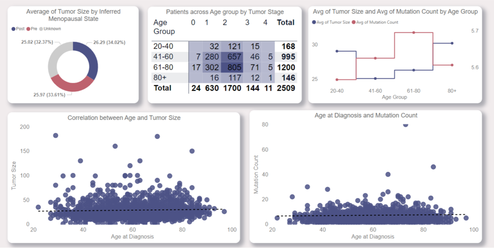

## 📊 Detailed Insights & Analysis

### 1. 📌 Dataset Overview

**Dataset Name**: METABRIC – Breast Cancer Dataset  
**Records**: 2,509 | **Columns**: 34

**Categories Covered**:
- 🧍‍♀️ **Patient Demographics**  
- 🧬 **Tumor Characteristics**  
- 💊 **Treatment Details**  
- 🧪 **Genomic Info**  
- 📈 **Survival Outcomes**

📘 <strong>Data Dictionary (Click to expand)</strong>

| Column Name                          | Description                                                                                   | Data Type             |
|-------------------------------------|-----------------------------------------------------------------------------------------------|------------------------|
| Patient ID                          | Unique patient identifier                                                                     | Text (String)         |
| Age at Diagnosis                    | Age when diagnosed with breast cancer                                                         | Whole Number          |
| Type of Breast Surgery              | Type of breast surgery performed                                                              | Text (Categorical)    |
| Cancer Type                         | Type of cancer                                                                                | Text (Categorical)    |
| Cancer Type Detailed                | Histological subtype of cancer                                                                | Text (Categorical)    |
| Cellularity                         | Proportion of cancer in residual tumor bed                                                    | Text (Categorical)    |
| Chemotherapy                        | Whether the patient received chemotherapy                                                     | Boolean               |
| Pam50 + Claudin-low subtype         | Molecular subtype of tumor                                                                    | Text (Categorical)    |
| Cohort                              | Study group or subset                                                                         | Whole Number          |
| ER status measured by IHC           | Estrogen receptor (ER) status via IHC                                                         | Text (Categorical)    |
| ER Status                           | ER-positive or ER-negative status                                                             | Text (Categorical)    |
| Neoplasm Histologic Grade           | Tumor grade (e.g., Grade 1, 2, 3)                                                              | Whole Number          |
| HER2 status measured by SNP6        | HER2 status via SNP6 array analysis                                                           | Text (Categorical)    |
| HER2 Status                         | Clinical HER2 status                                                                          | Text (Categorical)    |
| Tumor Other Histologic Subtype      | Additional histological tumor details                                                         | Text (Categorical)    |
| Hormone Therapy                     | Whether hormone therapy was administered                                                      | Boolean               |
| Inferred Menopausal State           | Inferred menopausal status                                                                    | Text (Categorical)    |
| Integrative Cluster                 | Molecular classification from multi-omics data                                                | Text (Categorical)    |
| Primary Tumor Laterality            | Side of the body where the primary tumor is located                                           | Text (Categorical)    |
| Lymph nodes examined positive       | Number of lymph nodes found positive                                                          | Whole Number          |
| Mutation Count                      | Count of somatic mutations in the tumor                                                       | Whole Number          |
| Nottingham prognostic index         | Prognostic score predicting survival                                                          | Decimal Number (Float)|
| Oncotree Code                       | Tumor type code based on OncoTree classification                                              | Text (Categorical)    |
| Overall Survival (Months)          | Months survived after diagnosis/treatment                                                     | Decimal Number (Float)|
| Overall Survival Status             | Alive or deceased at last follow-up                                                           | Text (Categorical)    |
| PR Status                           | Progesterone receptor (PR) status                                                             | Text (Categorical)    |
| Radio Therapy                       | Whether radiotherapy was given                                                                | Boolean               |
| Relapse Free Status (Months)       | Relapse-free duration in months                                                               | Decimal Number (Float)|
| Relapse Free Status                 | Whether patient experienced a relapse                                                         | Text (Categorical)    |
| Sex                                 | Biological sex of the patient                                                                 | Text (Categorical)    |
| 3-Gene classifier subtype           | Subtype classification based on 3-gene signature                                              | Text (Categorical)    |
| Tumor Size                          | Tumor size at diagnosis (in mm)                                                               | Whole Number          |
| Tumor Stage                         | Cancer stage (extent and spread)                                                              | Whole Number          |
| Patient's Vital Status              | Current status (e.g., alive, deceased)                                                        | Text (Categorical)    |

### 2. 🧹 Data Preprocessing
**Load and Clean Dataset**:
- Loaded the original data using Get Data >> Text/csv as my dataset are coma separated value.
- Then, click on Transform data to open power query editor to clean and preprocess the data.

- Checked the column quality and distribution to ensure data integrity and identify any empty and error values.
- Checked for the duplicates. But there are no duplicate rows in my dataset.

- Replacing Blanks and rounding up

- Renaming columns

- Treating Nulls:
- There are null values in many of the numerical column and the null values imputed by the median value.
- First, calculated the median value and then null values are replaced using the median.

### 3. 📐 Data Modeling
- Created reference table of the original table instead of duplicate table to maintains the integrity of the data model by avoiding unnecessary duplication and to simplify future modifications.
- After creating fact and dimensions tables, disabled load in the original table.
- Created relationship between Fact and Dimensions in star schema.
- The unique identifier Patient ID is used to the created the relationship between fact and dimensions table.
- Used one to many relationship for every table except Patients Outcomes.
- As the patients outcomes needs to be analysed over tumor characteristics, demographics, and treatment, I used one to one relationship.
- Fact: Fact_BreastCancer
- Dimensions:
  - Dim_Outcomes
  - Dim_Treatment
  - Dim_Patient
  - Dim_Research
  - Dim_Tumorcharacteristics

### 4. 💡 BI Questions & Answers

**How do patient demographics influence tumor characteristics?**

- The menopausal status does not cause any significant difference in the average tumor size.
- The 41-60 and 61-80 age group are most commonly having the Tumor stage 2.
- Tumor size and mutant count increases with the increase in age group (above 60)
- Age at diagnosis does not have that much correlation with tumor size and mutation.

  
**How do patient demographics influence patient outcomes?**

- The survival rate is higher in the age group 41-60 and lower in the 80+ age group.
- Relapse free status is higher in the age group 20-40 and lower in the 80+ age group.
- The survival rate is higher in the pre-menopausal status than the post-menopausal status.
- Young patients have high survival probability than the older age patients.
- Survival months and Relapse free months decreases with the increase in age.

**How do tumor characteristics (stage, size, subtype) impact treatment choices?**

- The laterality of the breast cancer does not have any significant difference. Both laterality are equal in opting for breast surgery.
- 3-gene classifier subtype influence the choice of choosing the hormone therapy.
- The patient with high cellularity are opting for the chemotherapy.
- The tumor stage and tumor size have the significant impact in choosing the combination of treatments. Patients with stage 3 tumor and Average tumor size 66.72 opted for the multimodal treatment (mastectomy, chemotherapy, hormone therapy and radio therapy).

**How do tumor characteristics (stage, size, subtype) impact patient outcomes?**

- The invasive breast carcinoma have least survival rate compared to other cancer subtype.
- Metaplastic breast cancer have high relapse rate and breast invasive mixed mucinous carcinoma have the least relapse rate.
- The survival months and relapse free months decreases with the increase in tumor size.
- Neoplasm histologic grade 1 have high survival rate compared to other two grade.

**How do different treatments (Surgery, Chemotherapy, Hormone Therapy, Radio Therapy) affect patient outcomes?**

- Breast conserving have high success rate compared to mastectomy and therapies.
- Patients underwent the breast conserving surgery have high survival rate than the mastectomy.
- Patients opting for the chemotherapy, Hormone therapy and Radio therapy have high survival rate than the patients not opting therapies.
- The recurrence rate is high in mastectomy than breast conserving surgery.

**What are the most significant factors influencing survival outcomes(Age, Tumor stage, Tumor Size, Treatment type, mutation count)?**
- Living:

- The survival rate increases with the decrease in age.
- Early tumor stage have high survival chances.
- Tumor size is 19 or less have the high survival rate.
- Treatment combinate like breast conserving, chemotherapy and radio therapy have high survival rate.
- The most significant key influencer survival (living) are age, tumor stage, tumor size and treatment choices.

- Deceased:
  

- The survival rate decreases with the increase in age.
- Tumor size more than 28 have less survival chances.
- Mastectomy and hormone therapy alone is not effective treatment.
- Tumor stage is more than 2 have less survival rate
- The most significant key influencer survival (deceased) are age, tumor stage, tumor size and treatment choices.

**What are the most significant factors influencing relapse outcomes(Tumor stage, Tumor Size, Treatment type, mutation count)?**

- Not Recurred:
  

- Cancer is not recurred when the age is more than 30.
- When tumor stage 0 or less have the low relapse rate.
- Tumor size 27 or less have the low relapse rate
- Breast invasive mixed mucinous carcinoma cancer subtype have less relapse rate.
- The significant key influencers for non-recurrence are age, tumor stage, size and cancer subtype.

- Recurred:

- The later tumor stage have the high relapse rate
- Age at diagnosis 30 or less have the high relapse rate
- Treatment combination choices like mastectomy, chemotherapy, hormone therapy have high relapse rate.
- The key influencers of the cancer recurrence are tumor stage, age and treatment choices.

### 7. 🧾 Summary of Findings
- Survival Trends: Patients with early-stage tumors (<Stage 2) and smaller tumor sizes (<2 cm) have significantly better survival outcomes.
- Treatment Effectiveness: Combination therapies and hormone therapy for ER/PR-positive patients yield higher survival rates.
- Tumor Characteristics: Tumor size, cellularity, and histologic grade are vital predictors of outcomes, especially for aggressive cancer subtypes like HER2-enriched and triple-negative.
- Patient Demographics: Post-menopausal status does not significantly affect outcomes when treatment is aligned with receptor status.
These insights demonstrate the importance of data-driven approaches in understanding breast cancer prognosis and optimizing treatment strategies.
